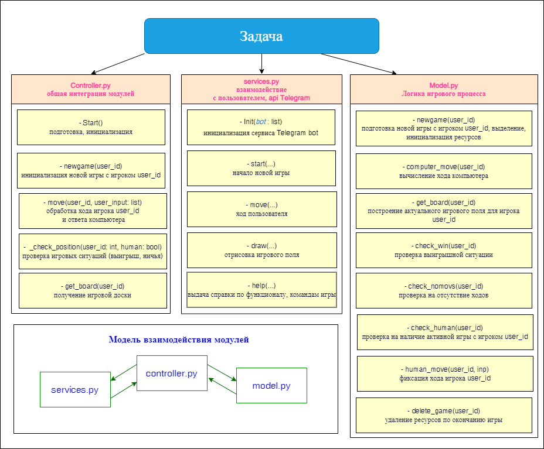
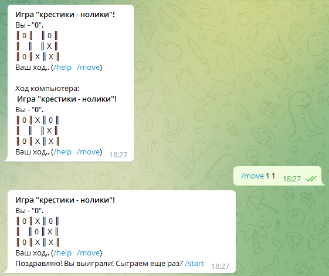

# GBTeam2

## Групповая работа по созданию игры "крестики - нолики" с использованием telegram - bot

Задача:

_Создать игровой проект "крестики-нолики" с использованием telegram - bot обладающий следующим функционалом:_

- игра против компьютера через telegram

__Участники:__

- Иван Давыдов - руководитель проекта [main.py](main.py), [model.py](model.py)
<https://github.com/dia-zx/GBTeam2>
- Михаил Мансуров - [controller.py](controller.py)
- Анна Костылева - [services.py](services.py)
<https://github.com/Koannko/Telegram_bot>

---
## Для запуска проекта необходимо:

- установить среду [Python3](https://www.python.org/downloads/);
- склонировать данный репозиторий, на локальный диск (ветку __release__);
- установить необходимые библиотеки выполнив в терминале, находясь в корне склонированного проекта, команду __pip install -r requirements.txt__ либо самостоятельно скачать библиотеку [python-telegram-bot (20.0a4)](https://pypi.org/project/python-telegram-bot/) и установить ее командой ___pip install python-telegram-bot___
- для запуска "*своего*" бота необходимо отредактировать файл [bot.txt](bot.txt)
- перейти в папку с файлами проекта ("main.py", ...);
- запустить на исполнение файл [main.py](main.py) в коммандной строке.

---
## Информация о проекте

Для разработки проекта использовался язык Python 3.10

---
## Правила и описание игры
Игрок и Бот по очереди ставят на свободные клетки поля 3×3 знаки: "X", "0". Первый, выстроивший в ряд 3 своих фигуры по вертикали, горизонтали или диагонали, выигрывает.
В начале игры случайным образом выбирается кто ставит "X", а кто "0". Первый ход делает "X" (крестик).
- для начала новой игры необходимо выполнить команду: __/start__
- для хода игрока необходимо выполнить команду: __/move__ после которой через пробел задать координаты поля X[0..2] Y[0..2], например:
__/move 0 1__ - означает, что игрок ставит свой символ в координату X = 0 и Y = 1
- для вывода изображения доски с игрой необходимо выполнить команду: __/draw__
- для вывода справки по командам игры необходимо выполнить команду: __/help__

---
